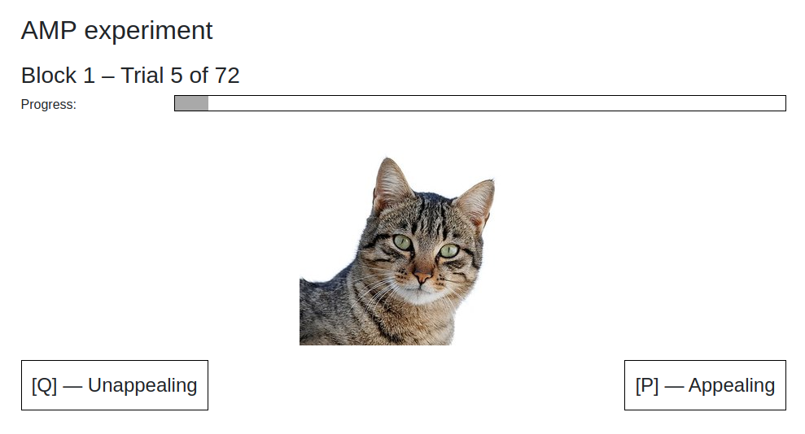

# Affect Misattribution Procedure (AMP) experiment for oTree

November 2019, Markus Konrad <markus.konrad@wzb.eu> / [Berlin Social Science Center](https://wzb.eu)

## Introduction

This repository contains an application for [oTree](http://www.otree.org/) ([Chen et al. 2016](http://dx.doi.org/10.1016/j.jbef.2015.12.001)) which implements the Affect Misattribution Procedure (AMP) experiment ([Payne et al. 2005](https://doi.org/10.1037/0022-3514.89.3.277), [Payne & Lundberg 2014](https://doi.org/10.1111/spc3.12148), [Teige-Mocigemba et al. 2017](https://doi.org/10.1027/1618-3169/a000364)).

Images of targets (Chinese characters) in directory `_static/amp/targets` were published by Keith Payne at http://bkpayne.web.unc.edu/research-materials/.

Makes use of the [otreeutils](https://github.com/WZBSocialScienceCenter/otreeutils) package ([Konrad 2018](https://doi.org/10.1016/j.jbef.2018.10.006)).

**Screenshot of a trial:**

## Features and limitations

- precise timing of prime and target exposures in milliseconds
- prime and target images are pre-loaded before first display to prevent download delay
- precise measurement of responses in milliseconds
- progress bar showing advancement of trials for each participant 
- each measurement is stored individually in the database
- live view of measurements during experiment in oTree's data view 
- easily adjustable (see configuration)
- requires keyboard for responses but may be extended to work on mobile devices as well
- results are transferred to server at the end of each *round* (each round or *block* consists of several trials), *not* after each trial

## Requirements

- Python 3.5 or higher (tested with Python 3.6)
- otree 2.1.41
- otreeutils 0.9.1

You can install the exact requirements using *pip*: `pip install -r requirements.txt`

## Configuration

### Prime and target images

For your own experiment, you probably want to exchange the prime images (the repository contains example images of cats and dogs) and optionally the target images. Both are located in `_static/amp/primes` and `_static/amp/targets` respectively.  

The repository comes with example images for two prime classes `prime_a` and `prime_b` inside the `primes` folder. The images are automatically loaded if you put them there and randomly assigned to the target classes. The number of images per prime class should be the same.

As explained before, the images for the targets are Chinese characters obtained from http://bkpayne.web.unc.edu/research-materials/ and divided into positive (`pos` folder) and negative (`neg` folder) classes. You may replace those images – you should only make sure that the number of images per target class is the same. The number of images determines the number of trials that are run per block.

### Further configuration via `Constants`

The `Constants` class in `amp/models.py` contains further configuration settings such as the number of blocks (`num_rounds`) and the display timings that determine for how long the prime and target image are shown. 

## Code structure and page sequence

### Models

A custom `Trial` class is defined in `amp/models.py` that stores information for each trial per player such as displayed prime / target and participant's response. The trials are set up in `creating_session()` in class `Subsession` where the prime and target images are detected in the respective folders and random assignment of primes and targets takes place (see `sample_targets_and_primes()`). 

### Pages and templates

The page sequence consists of four classes in `amp/pages.py`:

1. `IntroPage`
2. `AMPPracticePage`
3. `AMPPage`
4. `AMPFinished`

`AMPPracticePage` is derived from `AMPPage` and uses the same template (`AMPPage.html`) but sets `is_practice` to `True`. On the practice page, the participant can try out the experiment process without recording any measurments. Primes and targets for the practice page are loaded from the respective folders with `_practice` suffix in `_static/amp/`. The real test is then implemented in `AMPPage`, especially in the JavaScript functions of the HTML template. The randomized `Trial` objects are loaded for the participant for the given round and passed to the template where they are displayed. During the test, the response times and keys are recorded and submitted when the next block is loaded or all blocks are finished. The submitted trial responses are handled and stored to the database in the method `AMPPage.before_next_page()`.

## Data export

Since the measurements are stored using the custom data model `Trials` (see [this blog post](https://datascience.blog.wzb.eu/2016/10/31/using-custom-data-models-in-otree/) or [Konrad 2018](https://doi.org/10.1016/j.jbef.2018.10.006) for more on custom data models with oTree), the data is not exported automatically using oTree's data export page. However, two methods are provided to obtain the data in hierarchically structured JSON format:

1. You can access the page `https://<SERVER>/custom_export/` (e.g. `http://localhost:8000/custom_export/` on a local development machine) which, after logging in, lets you download the data.
2. You can use the `data_exporter.py` script, e.g. by executing `python data_exporter.py my_data.json` in the terminal, which will store the JSON data to `my_data.json`.

For later processing of the JSON data, you may use the `jsonlite` package for R or the built-in `json` module in Python.

## Tests

Automated tests are implemented in `amp/tests.py` and can be run via `otree test amp`.

## License

Apache License 2.0. See LICENSE file.
